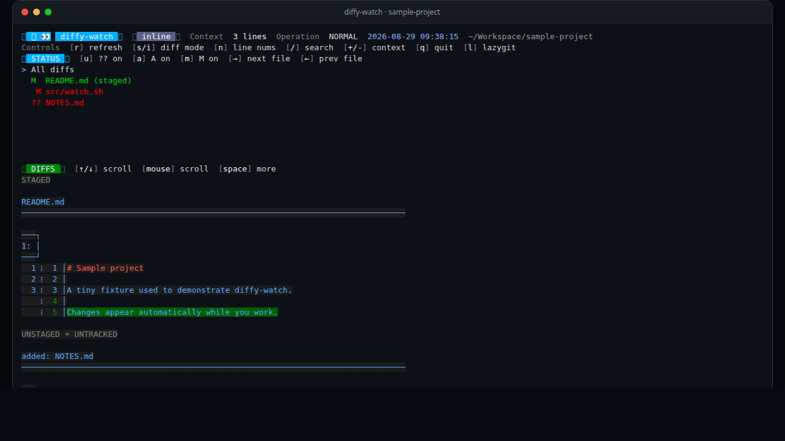
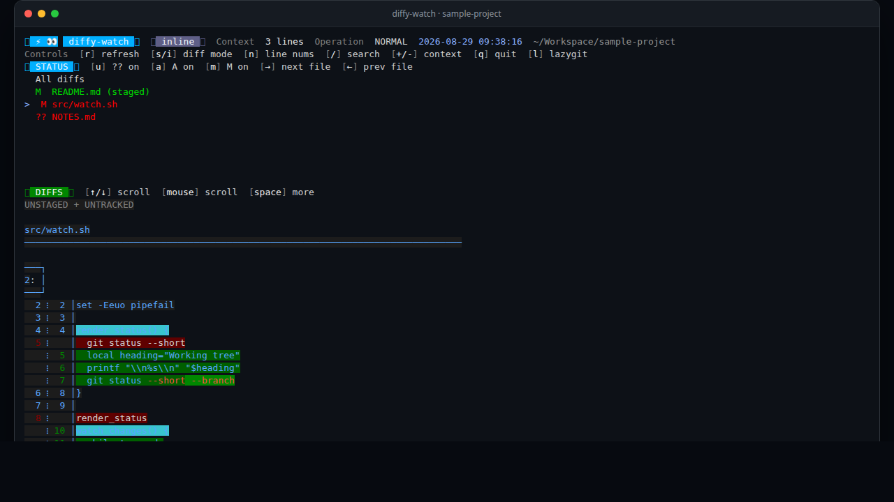

# ⚡ 👀 diffy-watch


`diffy-watch` is an interactive, auto-refreshing Git diff viewer for your terminal. Keep it open beside your editor to see staged, unstaged, and untracked changes update as you work—without rerunning `git diff` or losing your place.



## Why diffy-watch?

- Watches one Git worktree and refreshes only when its state changes.
- Shows staged, unstaged, and untracked changes in one view.
- Switches between inline and side-by-side diffs.
- Navigates by file with the keyboard or mouse.
- Searches inside the current diff and jumps between matches.
- Filters added, modified, and untracked files independently.
- Detects merges, rebases, cherry-picks, reverts, bisects, and conflicts.
- Opens [lazygit](https://github.com/jesseduffield/lazygit) in the watched repository.
- Uses a temporary Git index, so displaying untracked files never stages them in your real worktree.

<details>
<summary>View a static screenshot</summary>



</details>

## Requirements

- [Bash](https://www.gnu.org/software/bash/)
- [Git](https://git-scm.com/)
- [delta](https://dandavison.github.io/delta/installation.html) (usually packaged as `git-delta`)
- [lazygit](https://github.com/jesseduffield/lazygit#installation)
- Perl and standard terminal utilities such as `tput` and `stty`

On macOS or Linux with [Homebrew](https://brew.sh/), install the two application dependencies with:

```bash
brew install git-delta lazygit
```

For other Linux installations, use the linked upstream instructions or your distribution's packages. Confirm everything is available before installing `diffy-watch`:

```bash
git --version
delta --version
lazygit --version
```

## Installation

Make sure `~/.local/bin` is included in your `PATH`, then choose either method below.

### Download the script

```bash
mkdir -p "$HOME/.local/bin"
curl -fsSL \
  https://raw.githubusercontent.com/brodie-hodges/diffy-watch/master/diffy-watch \
  -o "$HOME/.local/bin/diffy-watch"
chmod +x "$HOME/.local/bin/diffy-watch"
```

To update later, repeat the `curl` command.

### Clone and symlink

```bash
mkdir -p "$HOME/.local/share" "$HOME/.local/bin"
git clone https://github.com/brodie-hodges/diffy-watch.git \
  "$HOME/.local/share/diffy-watch"
ln -s "$HOME/.local/share/diffy-watch/diffy-watch" \
  "$HOME/.local/bin/diffy-watch"
```

To update later:

```bash
git -C "$HOME/.local/share/diffy-watch" pull --ff-only
```

Verify the installation:

```bash
diffy-watch --help
```

## Usage

Run `diffy-watch` anywhere inside a Git worktree:

```bash
diffy-watch
```

Start in side-by-side mode, watch a different directory, or limit the view with Git pathspecs:

```bash
diffy-watch sbs
diffy-watch -n 1 ~/Workspace/project
diffy-watch sbs . -- packages/foo/src/file.ts
```

```text
Usage: diffy-watch [sbs] [-n SECONDS] [DIRECTORY] [-- DIFF_ARGS...]
```

`-n` / `--interval` sets the refresh interval in whole seconds (default: `2`). Arguments after `--` are passed to the Git status and diff commands as pathspecs.

## Controls

| Key | Action |
| --- | --- |
| `r` | Refresh immediately |
| `s` / `i` | Use side-by-side / inline diffs |
| `j` / `k`, `→` / `←` | Select the next / previous status row |
| `↑` / `↓` | Scroll the selected diff |
| `Space` | Show the next page of the selected diff |
| `/` | Search the current diff |
| `n` / `p` | Move to the next / previous search match |
| `Esc` | Exit search mode |
| `u` / `a` / `m` | Toggle untracked / added / modified files |
| `+` / `-` | Increase / decrease context lines |
| Mouse click / wheel | Select a file / scroll diffs |
| `l` | Open lazygit in the repository |
| `q` | Quit |

## How it stays safe

To make untracked files visible as normal diffs, `diffy-watch` copies the repository index into a temporary directory and runs `git add -N` against that copy. The real index is never used for those intent-to-add entries. Temporary state and terminal settings are cleaned up when the program exits, including after an error.

## Development

The project is intentionally small: the executable and its integration test suite are both Bash scripts.

```bash
bash -n diffy-watch test-diffy-watch.sh
./test-diffy-watch.sh
```

The tests create disposable Git repositories under the system temporary directory and exercise rendering, navigation, filtering, searching, paging, mouse input, lazygit launching, and in-progress Git operation safety.

## License

[MIT](LICENSE) © 2026 Brodie Hodges
